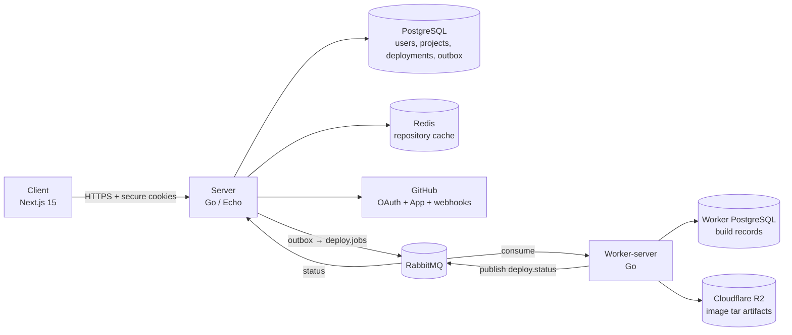
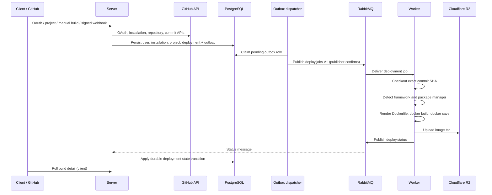
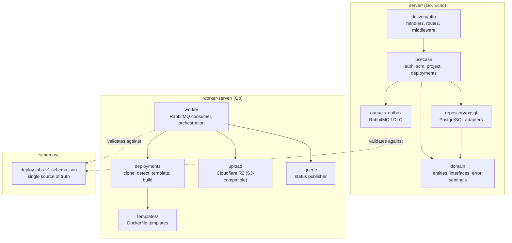

# Zero-DevOps

> A platform that removes the DevOps layer so developers can focus on building products.

Zero-DevOps takes a GitHub repository, resolves it to an immutable commit, builds it in an
isolated worker, and tracks the whole run as a durable, queryable deployment record. You
connect a GitHub App, pick a repository, and the platform handles detection, containerization,
and artifact storage.

**Status:** active development. Auth, GitHub App installation, repository selection, project
CRUD, manual and webhook-triggered builds, the transactional outbox dispatcher, and the worker
build pipeline are working end to end. The worker still uses Docker (not Buildah) and does not
yet publish terminal `success` on `deploy.status`. See [Project status](#project-status).

---

## Table of contents

- [Why this exists](#why-this-exists)
- [Architecture](#architecture)
- [Workspaces](#workspaces)
- [Tech stack](#tech-stack)
- [Getting started](#getting-started)
- [API surface](#api-surface)
- [Data model](#data-model)
- [Shared contract](#shared-contract)
- [Project status](#project-status)
- [Projected direction](#projected-direction)
- [Documentation](#documentation)
- [Contributors](#contributors)

---

## Why this exists

Shipping a small application still means writing a Dockerfile, wiring CI, managing registry
credentials, configuring a queue, and debugging build reproducibility. Most of that work is
identical across projects and none of it is the product.

Zero-DevOps takes an opinionated position on each of those decisions:

- **Builds are immutable.** Every build is keyed by `(repository, ref, commit_sha, configuration_version, trigger)`. The worker never builds a moving branch tip.
- **The queue is the boundary.** The API server never builds. It validates, persists, and publishes a job. The worker never talks to the client.
- **Contracts are versioned files, not conventions.** The `deploy.jobs` V1 message lives in a JSON Schema that both Go services compile against and validate in conformance tests.
- **Framework detection replaces configuration.** The worker detects the framework and package manager, then renders a Dockerfile from a template unless the repository ships its own.

---

## Architecture

The system is four workspaces: a Next.js client, a Go API server, a Go build worker, and a
shared schema package. The client only ever talks to authenticated server APIs — never to
GitHub, RabbitMQ, or PostgreSQL directly.

### Current system



### Build lifecycle



### Layered structure

Both Go services use a clean-architecture package layout, so the delivery mechanism, business
rules, and persistence are independently replaceable.



Full detail, including the planned target architecture, lives in
[`docs/architecture.md`](docs/architecture.md).

---

## Workspaces

| Workspace | Purpose |
| --- | --- |
| `client/` | Next.js 15 web UI — landing page and authenticated app shell. |
| `server/` | Go (Echo) API — auth, GitHub integration, projects, builds, webhooks, outbox. |
| `worker-server/` | Go build worker — consumes jobs, builds images, uploads artifacts. |
| `schemas/` | Shared versioned contracts (`deploy.jobs` V1 JSON Schema and fixtures). |
| `docs/` | Architecture, projected direction, and Buildah/webhook design notes. |

### Server packages

| Package | Responsibility |
| --- | --- |
| `internal/auth` | GitHub OAuth login/refresh/logout/current-user, JWT session cookies, auth middleware. |
| `internal/integrations/scm` | GitHub App lifecycle, installation tokens, repository listing, webhook ingress. |
| `internal/project` | Selected-project CRUD, branch/command configuration, command scanner and policy. |
| `internal/deployments` | Builds, outbox dispatcher, `deploy.status` consumer, V1 contract. |
| `internal/queue` | RabbitMQ exchange, queue, and DLQ declaration. |
| `internal/domain` | Shared entities, interfaces, error sentinels. |
| `config`, `internal/logger`, `internal/middleware`, `internal/helper` | Viper config, Zap logging, CORS/request-ID, response envelopes. |

### Worker packages

| Package | Responsibility |
| --- | --- |
| `internal/worker` | RabbitMQ consumer (manual ack, prefetch 1) and job orchestration. |
| `internal/deployments` | Exact-SHA cloning, framework detection, Dockerfile templating, Docker build, image tar save. |
| `internal/deployments/contract` | V1 `deploy.jobs` contract mirror, validated against the shared schema. |
| `internal/queue` | RabbitMQ queue bindings and status publisher. |
| `internal/upload` | Image tar upload to Cloudflare R2. |
| `templates/` | Dockerfile templates per detected framework. |

---

## Tech stack

**Client** — Next.js 15, React 19, TypeScript (strictest config), Tailwind CSS, shadcn/ui
(New York), Radix UI, Zustand, TanStack Query, React Hook Form, Zod, Axios, next-themes,
Framer Motion, Lucide React, CVA.

**Server and worker** — Go 1.25, Echo, PostgreSQL, Redis, RabbitMQ, Viper, Zap, Goose
migrations, golangci-lint, gotestsum, mockery, Air for hot reload.

**Infrastructure** — Docker and Docker Compose, Cloudflare R2 (S3-compatible object storage),
GitHub App and OAuth, GitHub Actions CI with path filters.

---

## Getting started

### Prerequisites

- Go 1.25+
- Node.js 20+
- Docker and Docker Compose
- A GitHub App with OAuth credentials, webhook secret, and a private key

### 1. Server

```bash
cd server
cp .env.example .env          # OAuth, GitHub App, DB, RabbitMQ, Redis, webhook secret
make install-deps             # goose, air, gotestsum, tparse, mockery
make dev-env                  # start PostgreSQL + RabbitMQ + Redis
make migrate-up               # apply Goose migrations
make up                       # run the API server with hot reload (Air)
```

Default address is `127.0.0.1:8750`. Details: [`server/README.md`](server/README.md).

### 2. Worker

```bash
cd worker-server
cp .env.example .env          # DB, RabbitMQ, Cloudflare R2 credentials
make install-deps
make dev-env                  # start worker PostgreSQL + RabbitMQ
make migrate-up
make up                       # run the worker with hot reload
```

The worker needs a reachable Docker daemon. Details: [`worker-server/README.md`](worker-server/README.md).

### 3. Client

```bash
cd client
cp .env.example .env.local    # set NEXT_PUBLIC_API_URL to the server address
npm install
npm run dev
```

Open http://localhost:3000. Details: [`client/README.md`](client/README.md).

### Verification commands

| Workspace | Commands |
| --- | --- |
| `server/` | `make lint`, `go vet ./...`, `make tests`, `make build` |
| `worker-server/` | `make lint`, `go vet ./...`, `make tests`, `make build` |
| `client/` | `npm run lint`, `npm run typecheck`, `npm run build` |

CI runs the same checks per workspace using path filters, plus a dedicated
`deploy.jobs` schema conformance test.

---

## API surface

All routes are cookie-authenticated unless noted. Session cookies are `access_token` and
`refresh_token`. Public auth middleware skips: `/auth/github/login`,
`/auth/github/login/callback`, `/auth/refresh`, `/webhooks/github`.

**Auth**

| Method | Path | Purpose |
| --- | --- | --- |
| `GET` | `/auth/github/login` | Start OAuth, set state cookie, redirect to GitHub. |
| `GET` | `/auth/github/login/callback` | Exchange code, issue session cookies. |
| `POST` | `/auth/refresh` | Rotate session tokens. |
| `POST` | `/auth/logout` | Clear session and cookies. |
| `GET` | `/auth/user/me` | Current user. |

**GitHub integration**

| Method | Path | Purpose |
| --- | --- | --- |
| `GET` | `/integrations/github/installation` | Installation record and status. |
| `GET` | `/integrations/github/repositories` | Paginated repository picker (Redis-cached). |
| `POST` | `/integration/scm/github/install` | Install GitHub App from OAuth code (legacy path). |
| `GET` | `/integration/scm/github/` | Stored installation (legacy path). |
| `DELETE` | `/integration/scm/github/delete` | Disconnect installation (legacy path). |

**Projects**

| Method | Path | Purpose |
| --- | --- | --- |
| `GET` / `POST` | `/projects` | List and create selected projects. |
| `GET` / `PATCH` / `DELETE` | `/projects/:id` | Read, update, delete a project. |

**Builds**

| Method | Path | Purpose |
| --- | --- | --- |
| `POST` | `/projects/:id/builds` | Manual build — resolve ref → SHA, snapshot config, write deployment + outbox. |
| `GET` | `/projects/:id/builds` | Build history for a project. |
| `GET` | `/builds/:id` | Build detail (includes `build_number`). |

**Webhooks**

| Method | Path | Purpose |
| --- | --- | --- |
| `POST` | `/webhooks/github` | Public GitHub App ingress (HMAC-verified); push events create builds via the outbox. |

Legacy `POST /deploy` has been **removed**. All builds flow through project builds or the webhook.

---

## Data model

Server PostgreSQL, managed with forward-only Goose migrations:

| Table | Contents |
| --- | --- |
| `users` | OAuth user identity and refresh token. |
| `github_installations` | Installation ID, account, `status` (`active` / `suspended` / `uninstalled`). |
| `projects` | Selected repository, branch, webhook flag, build configuration, generation / build counters. |
| `deployments` | Build runs with full V1 fields, `build_number`, trigger, config snapshot, idempotency key. |
| `webhook_deliveries` | GitHub delivery ID dedup and audit trail. |
| `deployment_outbox` | Durable outbox (`pending` / `sent` / `dead`); dispatcher is the only `deploy.jobs` producer. |

The worker keeps its own PostgreSQL database for worker-side build records.

---

## Shared contract

[`schemas/deploy-jobs-v1.schema.json`](schemas/deploy-jobs-v1.schema.json) is the single source
of truth for the RabbitMQ `deploy.jobs` message. Both Go services compile against that file
and validate it in conformance tests (plus fixtures under `schemas/fixtures/`).

V1 is immutable. A future V2 would ship alongside V1 for a bounded migration window.
`deploy.status` is a separate, deliberately looser contract.

Versioning and wire-format rules: [`server/_reference/deploy-jobs-contract.md`](server/_reference/deploy-jobs-contract.md).

---

## Project status

### Done — server

- **Auth** — GitHub OAuth login/callback/refresh/logout/me; JWT cookies; public-path skipping.
- **GitHub installation** — install/get/delete + status tracking + installation gate.
- **Repository picker** — paginated, Redis-cached (fail-open), single-flight, installation-scoped.
- **Projects** — full CRUD with branch config, webhook flag, command scanning/policy.
- **Manual builds** — `StoreProjectBuildWithOutbox` (immutable SHA, idempotency key, `build_number`).
- **Webhook builds** — `POST /webhooks/github` fully wired (HMAC, delivery dedup, branch match, outbox).
- **Outbox dispatcher** — sole `deploy.jobs` producer; publisher confirms; stuck-row reconciliation; dead-letter state.
- **Durable status consumer** — `deploy.status` with manual ack and legal-transition validation.
- **V1 contract** — shared schema + Go packages in both services, conformance tests.
- **CI** — path-filtered server / worker / client jobs.

### Done — worker

- Consumes `deploy.jobs` V1 with strict validation; invalid messages → `deploy.jobs.dlq`.
- Checks out exact `commit_sha`; framework detection; Docker build; R2 tar upload.
- Publishes `building` / `failed` / `canceled` on `deploy.status`.

### In progress / known gaps

- **Worker never publishes `success`** — successful builds can stay `building` on the server. Top worker fix.
- Worker redelivery can reset terminal rows; retry path can duplicate concurrent builds on crash.
- V1 `configuration` is not applied to the build; Buildah isolation and OCI registry push are not started.
- Client UI: landing + app shell + auth exist; repository picker, project form, and build views are not built yet.
- Legacy `/integration/scm/github/...` routes coexist with `/integrations/...`; refresh tokens stored raw.
- Live broker/DB failure-recovery tests and runtime validation of build-number migration still pending.

Full snapshot: [`docs/architecture.md`](docs/architecture.md) §3.

---

## Projected direction

The target is a reliable, queue-driven pipeline that accepts webhook-triggered and manual
builds, builds in an isolated rootless worker, and publishes immutable digest-addressed OCI
images.

```mermaid
flowchart LR
    GH["GitHub App<br/>webhook"] -->|"POST /webhooks/github"| Ingress["Webhook ingress<br/>raw body + HMAC validation"]
    Ingress --> Dedup["Delivery deduplication<br/>X-GitHub-Delivery"]
    Dedup --> State["PostgreSQL transaction<br/>lifecycle + project + deployment"]
    State --> Outbox["Deployment outbox"]
    Outbox -->|"publisher confirms"| MQ[("RabbitMQ<br/>deploy.jobs")]
    MQ --> Claim["Isolated build worker<br/>manual ack + bounded concurrency"]
    Claim --> Checkout["Checkout exact<br/>commit SHA"]
    Checkout --> Config["Approved config<br/>or scanner fallback"]
    Config --> Build["Buildah executor<br/>rootless + resource limits"]
    Build --> Result["Image digest +<br/>bounded build logs"]
    Result --> Status["Durable deploy.status<br/>state transition"]
    Status --> State
    Result --> Registry[("OCI registry<br/>publish by digest")]
    Client["Client UI"] -->|"authenticated API"| State
    Client -->|"poll / reconnect"| Status
```



Remaining target boundaries (webhook/outbox reliability largely landed; executor and registry still ahead):

1. **Build executor** — Buildah behind a `BuildExecutor` interface, rootless, with resource limits and workspace isolation.
2. **Image / registry** — `ImageStore` / `ImagePublisher`; digest-addressed publish instead of local tar → R2.
3. **Client UI** — repository picker, project form, manual-build form, build detail/status (polling first).
4. **Worker reliability** — publish `success`, fix redelivery reset, single requeue/DLQ semantics, honor V1 configuration.

Roadmap: [`docs/projected-direction.md`](docs/projected-direction.md). Buildah/webhook design notes:
[`docs/buildah-webhook-worker-architecture.md`](docs/buildah-webhook-worker-architecture.md).

---

## Documentation

| Document | Contents |
| --- | --- |
| [`docs/architecture.md`](docs/architecture.md) | Current and planned architecture, data model, completion status. |
| [`docs/projected-direction.md`](docs/projected-direction.md) | Roadmap: end state, gap analysis, phased plan. |
| [`docs/buildah-webhook-worker-architecture.md`](docs/buildah-webhook-worker-architecture.md) | Deep design for webhook ingress and the Buildah-based worker. |
| [`docs/deployment-pipeline.md`](docs/deployment-pipeline.md) | The worker's actual build pipeline today — every step, why it exists, static/SSR detection, retry and finalize behavior. |
| [`schemas/deploy-jobs-v1.schema.json`](schemas/deploy-jobs-v1.schema.json) | Shared `deploy.jobs` V1 JSON Schema. |
| [`server/_reference/deploy-jobs-contract.md`](server/_reference/deploy-jobs-contract.md) | Contract versioning and wire-format policy. |
| [`server/README.md`](server/README.md) | Server setup, APIs, config, local workflow. |
| [`worker-server/README.md`](worker-server/README.md) | Worker setup, job flow, templates, known gaps. |
| [`client/README.md`](client/README.md) | Client stack, structure, and conventions. |
| [`server/_reference/`](server/_reference) | Historical plans, handoff notes, and engineering logs. |

---

## Contributors

Developed by:

- [@Parth06102006](https://github.com/Parth06102006)
- [@dkhushi6](https://github.com/dkhushi6)
