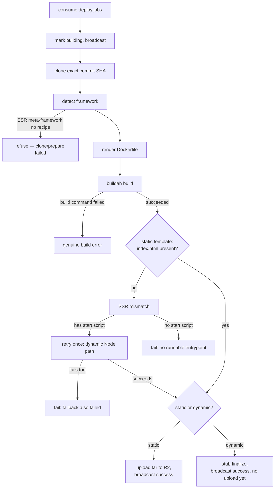

# Worker Deployment Pipeline

> How `worker-server` turns a `deploy.jobs` message into a built (and, for static
> sites, uploaded) artifact — every step, and why it exists. This documents the
> pipeline as it actually runs today; see
> [`buildah-webhook-worker-architecture.md`](buildah-webhook-worker-architecture.md)
> for the longer-term target design and
> [`projected-direction.md`](projected-direction.md) for the phased roadmap.

Everything below lives in `worker-server/internal/deployments/` (`deployments.go`,
`detect.go`) and `worker-server/internal/worker/worker.go`. One deployment job flows
through these steps in order; a failure at any step short-circuits to
[failure handling](#failure-handling--retries) rather than continuing.

---

## 1. Consume the job

**What:** `worker.StartWorker` consumes `deploy.jobs` with `Qos(1, 0, false)` — one
unacknowledged message at a time — and manually acks/nacks after processing.

**Why it matters:** manual ack means a worker crash mid-build redelivers the job
instead of silently losing it. `Qos(1)` means one worker never claims more work than
it can actually process, so a slow build doesn't starve other jobs sitting in the
queue behind it.

## 2. Mark building

**What:** `prepareAndMarkBuilding` inserts the worker's own local record (only on the
first attempt — `retryCount == 0`, so a retry doesn't double-insert), marks it
`building`, and broadcasts that status to the server over `deploy.status`.

**Why it matters:** this is the only point where the server's deployment row moves
off its initial state. Everything downstream depends on it happening exactly once
per job, not once per retry attempt — otherwise a retried job would redundantly
re-insert or re-broadcast state the server already has.

## 3. Clone the exact commit SHA

**What:** `cloneRepo` validates the clone URL (`https://` only, `github.com` only, no
`-`-prefixed argument-injection strings), validates the commit SHA against a strict
40-hex-char pattern, then does a manual shallow fetch of that exact SHA — never a
branch, never `HEAD`.

**Why it matters — two different things, both real:**
- **Correctness:** builds are pinned to an immutable commit. If the branch moves
  between "job enqueued" and "job processed," the build still reflects the commit the
  job was actually accepted for, not whatever the branch tip drifted to.
- **Reliability:** `runGit` runs every git command in its own process group
  (`Setpgid`) and kills the whole group on timeout, with `WaitDelay` as a backstop
  that force-closes I/O pipes if anything survives the kill. `git fetch` spawns a
  `git-remote-https` child that inherits those pipes — without this, a child stuck on
  a stalled network read (a real, observed failure mode; a fresh retry of the same
  clone succeeded instantly) leaves the parent's `cmd.Wait()` blocked forever, past
  the configured timeout, with no way to recover except killing it by hand.

## 4. Detect the framework

**What:** `detectFramework` runs four ordered phases — config-file match, then
package.json dependency scan, then a Python deep-walk, then a bare-Dockerfile
fallback — returning on the first match. Order matters: e.g. Next.js's config file is
checked before React's dependency-only match, because every Next.js repo also has
`react` as a dependency.

**Why it matters:** this single decision determines which Dockerfile template
renders, whether the build even attempts to run, and — critically — whether the
deployment is treated as static (upload files, no runtime) or dynamic (container
keeps running). Getting it wrong doesn't always look like a failure: a
misclassified SSR app can build "successfully" against the wrong target and produce
something unreachable. See [static vs. SSR detection](#static-vs-ssr-detection)
below for how this is defended.

### Static vs. SSR detection

A repo matching `vite.config.*` or `astro.config.*` isn't automatically static — a
Vite-based SSR meta-framework (TanStack Start, vike, Qwik City) uses the exact same
config file. Two layers catch this:

- **Layer 1 — dependency check** (`checkSSRMetaFramework`, cheap, pre-build): scans
  `package.json` for known SSR meta-framework markers. `viteSSRRecipes` routes
  frameworks that have a real deployment recipe (currently TanStack Start, via a
  `NITRO_PRESET=node-server` build-time override — see the template) to that recipe
  instead of the plain static one. `viteSSRMetaFrameworkDeps` refuses outright for
  frameworks with no recipe yet (vike, Qwik City, Waku) rather than guessing. This is
  a blocklist and therefore inherently incomplete — a hand-rolled SSR setup with no
  named package, or a framework not yet on the list, won't be caught here.
- **Layer 2 — output verification** (the `test -f .../index.html` step baked into
  every static template, post-build): this is the actual ground truth, and it's
  framework-agnostic — it doesn't need to recognize the tool that built the app, only
  whether the result looks like a static site. This is what catches everything
  Layer 1's blocklist can't, including frameworks nobody's written a check for yet.

## 5. Render the Dockerfile

**What:** `writeDockerfile` reads the builder's template (`templates/static/*.tmpl`
or `templates/dynamic/*.tmpl`), substitutes the package manager's install command
(swapping the base image to `oven/bun:1-alpine` for bun projects — builder stage and
any unnamed runtime stage only, never a static template's `AS runtime` stage, which
only needs npm-bundled `serve`), and substitutes `__OUTPUT_DIR__` with the resolved
build output directory.

**Why it matters:** `resolveOutputDir` checks for a framework-specific override
(custom `outDir` in vite/astro config, CRA's `BUILD_PATH` env var) before falling
back to the framework's conventional default (`dist`, `build`, `public`). Hardcoding
one directory name breaks the moment a project customizes it — this is a real,
common case, not a hypothetical.

## 6. Build

**What:** `buildImage` runs `buildah bud`, streaming output live while also
capturing it into a buffer.

**Why it matters:** the capture is what makes step 7 possible. Without it, a build
failure is just an opaque non-zero exit — there'd be no way to tell "the compiler
errored" apart from "the build succeeded but produced the wrong shape of output"
after the fact, which is exactly the distinction the next step depends on.

## 7. Verify static output, retry if justified

**What:** every static template's last builder-stage step is
`test -f ./__OUTPUT_DIR__/index.html || (echo "ZERODEVOPS_SSR_MISMATCH: ..." && exit 1)`.
If `buildImage` fails, `ProcessDeployment` checks the captured output for that
sentinel string:

- **Sentinel absent** → a genuine build error (the build command itself failed).
  Fails immediately with the real compiler/bundler output.
- **Sentinel present** → the build succeeded but produced no static output —
  `retryAsDynamic` checks `package.json` for a real `"start"` script. If one exists
  (proof a server entrypoint exists, not a guess), it retries **once** through the
  generic dynamic Node template. If there's no `start` script, or that retry also
  fails, the deployment fails with a specific, actionable message instead of looping.

**Why it matters:** this is what turns "misdetection" from a silent, broken
deployment into either a clean recovery or a clear, honest failure. The retry is
deliberately narrow — it never blindly retries an unknown recipe, because that would
just fail identically a second time (confirmed: this is exactly what would have
happened for TanStack Start's default Cloudflare Workers target before it got a real
recipe).

## 8. Finalize

**What:** `ProcessDeployment` tracks `isStatic` from the detected builder's
`DefaultOutputDir` (non-empty means static), flipping to `false` if step 7's dynamic
retry fires. The finalize step branches on that:

- **Static** → `uploadAndFinalize`: uploads the tar to R2, saves the output URL, marks
  finished, and broadcasts `success` with the real URL.
- **Dynamic** → `finalizeDynamicStub`: marks finished and broadcasts `success`, but
  does **not** upload anywhere — there's no container registry or runner yet (see
  [known gaps](#known-gaps)), so this is a deliberate placeholder rather than
  uploading a tar nothing can use.

**Why it matters:** a flat tar in object storage is the right artifact for a static
site (something eventually syncs those files to a CDN) but not for a dynamic one — a
future runner needs to `docker pull` an image, which means a registry push by digest,
not a tar in a bucket. Uploading dynamic tars to R2 anyway would just be dead weight
with no consumer.

## Failure handling & retries

**What:** `markFailed` records the attempt in the worker's own local DB and returns
an error — but never broadcasts `"failed"` to the server. `"failed"` is a *terminal*
status server-side (once set, the server rejects any other status for that
deployment). `worker.go` is the only place that knows whether an attempt is the
*final* one: it retries up to `MAX_RETRIES_COUNT` (default 3) by silently
republishing the job (no status broadcast — the server's row stays at `building`,
which isn't terminal), and only broadcasts `canceled` once retries are exhausted.

**Why it matters:** broadcasting `"failed"` on an attempt that's about to be retried
tells the server the deployment is finished when it isn't. The next attempt's
`building` broadcast — or the eventual `canceled` — would then be rejected as an
invalid transition out of a terminal state and dead-lettered to
`deploy.status.dlq`. This was a real, observed bug: retrying a permanent detection
rejection produced repeated dead-lettered status messages against an
already-terminal row, fixed by moving terminal-status broadcasting to the one place
that actually knows an attempt is final.

---

## Known gaps

| Gap | Status |
| --- | --- |
| Dynamic images have no registry/runner — `finalizeDynamicStub` marks success but uploads nothing | Open |
| No container ever actually *runs* to serve traffic — build stops at "image built" for both tracks | Open |
| 14 detected frameworks have no template yet (Nuxt/SvelteKit/etc. now do; remaining gaps are lower-traffic languages) | Partially closed this session |
| No manual `deployment_type` override for when detection is wrong | Open |
| `viteSSRMetaFrameworkDeps`/`astroSSRAdapterDeps` are blocklists — incomplete by construction | Open, Layer 2 is the mitigation |

See [`projected-direction.md`](projected-direction.md) for how these fit into the
broader roadmap.
