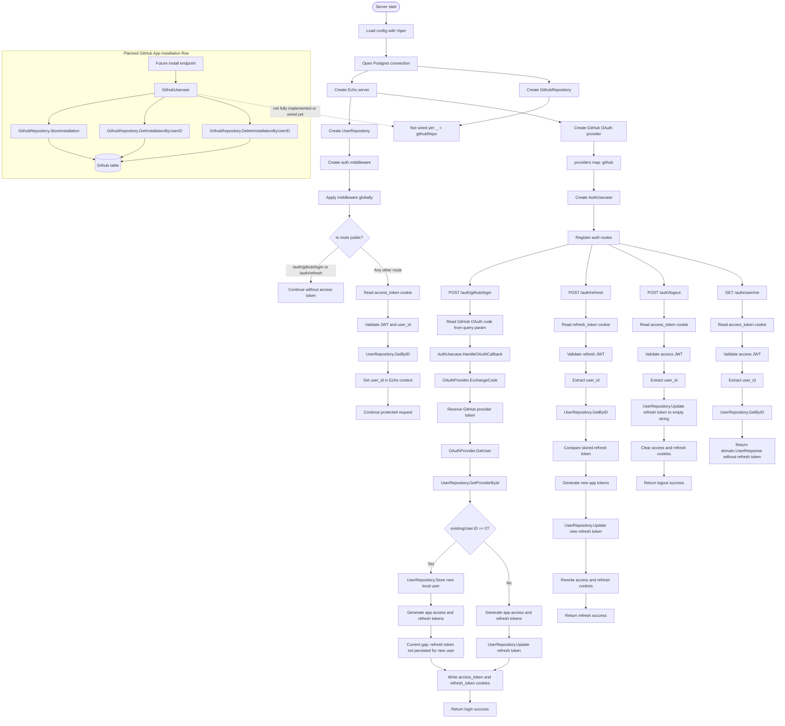
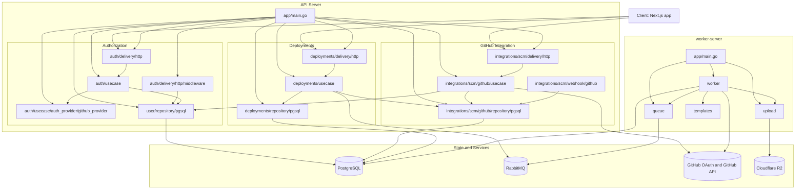

# Authorization And GitHub App Progress

Updated: 19 May 2026

This document is a revision note for the current authorization work. It explains what has been built, what the intended flow is, what looks wrong right now, and what should be fixed before adding the final APIs.

## Overall Progress

The project is still following the clean architecture style:

- `domain` contains the core contracts and entities.
- `authorization/auth/usecase` contains OAuth login and token session logic.
- `authorization/auth/delivery/http` is intended to expose HTTP endpoints.
- `authorization/user/repository/pgsql` stores OAuth users and refresh tokens in Postgres.
- `authorization/github/repository/pgsql` stores GitHub App installation data in Postgres.
- `authorization/auth/usecase/auth_provider` contains the GitHub OAuth provider adapter.

The important domain objects already drafted are:

- `User`: stores provider user information, username, email, avatar, created time, and refresh token.
- `OAuthUser`: normalized user profile returned by an OAuth provider.
- `TokenResponse`: app-owned access token and refresh token.
- `GithubInstallation`: intended to store the GitHub App installation ID against the local user.

The important interfaces already drafted are:

- `OAuthProvider`: exchanges OAuth code and fetches provider user profile.
- `AuthUsecase`: handles OAuth callback, refresh token, and logout.
- `UserRepository`: loads, creates, and updates authorization users.
- `GithubUsecase`: should handle GitHub App installation, lookup, and deletion.
- `GithubRepository`: persists and deletes installation records.

## Current Intended Flow

1. Frontend sends the GitHub OAuth callback `code` to the backend.
2. `AuthUsecase.HandleOAuthCallback` selects the provider from `providers["github"]`.
3. GitHub provider exchanges the code for a GitHub OAuth access token.
4. GitHub provider calls `https://api.github.com/user`.
5. Usecase checks if this GitHub user already exists locally by provider ID.
6. If the user does not exist, create a local user.
7. If the user exists, rotate the stored refresh token.
8. Backend returns app-owned access and refresh tokens.
9. Future GitHub App API will store `user_id`, `installation_id`, and `account_name`.
10. Future deletion API will remove the installation record for a user.

This separation is good. The app session token is your token, not the GitHub token. That keeps GitHub OAuth and your own session management loosely coupled.

## Today's Todo

Primary task: add the authorization API after fixing the current compile and flow issues.

Recommended authorization endpoints:

- `GET /auth/github/login`: optional endpoint that returns or redirects to the GitHub OAuth URL.
- `GET /auth/github/callback` or `POST /auth/github/callback`: receives `code`, calls `HandleOAuthCallback`, returns app tokens.
- `POST /auth/refresh`: accepts refresh token and returns new tokens.
- `POST /auth/logout`: invalidates the stored refresh token.
- `GET /auth/me`: reads the access token and returns the current user.

Second task: add GitHub App installation APIs.

Recommended GitHub App endpoints:

- `POST /integrations/github/installations`: store `installation_id`, `account_name`, and current authenticated `user_id`.
- `GET /integrations/github/installation`: return the current user's stored installation.
- `DELETE /integrations/github/installation`: delete the current user's stored installation.

Keep the route name generic enough for future apps by using `integrations`, but keep the implementation package focused on GitHub for now. Later, `integrations/slack`, `integrations/vercel`, or other apps can follow the same pattern.

## Recommendations Before Adding APIs

Fix compile issues first. The API layer will be hard to reason about while names, imports, and interfaces do not match.

Use consistent names:

- Current code has `GithubInstalltion`, `GithubInstallation`, `InstalltionID`, and `InstallationID` mixed together.
- Current code has `GithubRepositry`, `GithubRepository`, `StoreInstalltion`, and `StoreInstallation` mixed together.
- Pick one spelling everywhere: `GithubInstallation`, `InstallationID`, `GithubRepository`, `StoreInstallation`.

Keep domain independent:

- Domain interfaces should not import Echo, SQL, OAuth libraries, Viper, or GitHub SDKs.
- Usecases should depend on domain interfaces.
- Repositories and providers should depend inward on domain contracts.
- HTTP handlers should translate HTTP requests into usecase calls.

Do not store GitHub OAuth tokens as your app session. The current idea is correct: generate your own access and refresh tokens after OAuth succeeds.

Store refresh tokens carefully:

- Prefer storing a hash of the refresh token, not the raw token.
- Rotate refresh tokens during refresh.
- On logout, clear the stored refresh token or mark the session revoked.

For GitHub App installation storage:

- Make `(user_id, provider)` or `user_id` unique for GitHub if only one GitHub App installation per user is allowed.
- Use `INSERT ... ON CONFLICT ... DO UPDATE` so reinstalling or changing account does not create duplicate rows.
- Do not ask the user to install again if a valid installation exists.
- Add delete behavior that removes the installation row when the user disconnects GitHub.

## Do You Need Custom Auth?

Not right now.

For the current product flow, GitHub OAuth is enough because the main product depends on GitHub identity and GitHub App installation. Custom email/password auth would add password hashing, verification, password reset, session security, and account linking before the core integration is stable.

Add custom auth later only if:

- Users need to log in without GitHub.
- You need organization admins who are not developers.
- You want multiple login providers linked to one account.
- You need enterprise login methods such as Google Workspace or SSO.

Current recommendation: finish GitHub OAuth and GitHub App installation first. Keep the domain flexible enough to add custom auth later, but do not implement it yet.

## Loose Coupling And Decentralized Structure

Yes, you are allowed to keep it decentralized and loosely coupled. That is the point of the clean architecture direction.

The useful rule is this:

- Domain defines what the system needs.
- Usecase defines business flow.
- Repositories and providers handle external details.
- Delivery/http only handles transport.

Debate:

- A decentralized package structure gives flexibility and testability.
- Too much decentralization too early can create naming drift and half-connected interfaces.

Balanced recommendation:

- Keep auth, user, and GitHub integration as separate packages.
- Keep interface names in `domain`.
- Keep only one public constructor per concrete adapter.
- Wire everything in `app/main.go`.
- Do not let controllers call repositories directly.

## Current Issues Found In The Flow

These are important before adding controllers.

1. The code currently has compile errors.

- `domain/github.go` defines `GithubInstalltion`, but other files use `GithubInstallation`.
- `domain/github.go` defines `GithubRepositry`, but repositories return `domain.GithubRepository`.
- `UserRepository` defines `GetProviderById`, but usecase calls `GetByProviderId`.
- Repository methods return `nil` where the interface expects `domain.User`.
- Some repository files are missing `package` declarations.
- Some imports are invalid, for example `import ("context", "database/sql")` uses a comma.
- `github_provider.go` imports `domain` instead of the module path.
- `main.go` references `_authUcase`, `AuthProvider`, and `domain` without matching imports.
- `auth_handler.go` registers methods that are not implemented.

2. Token generation happens before a new user's database ID is known.

In `HandleOAuthCallback`, tokens are generated from `oauthUser`, but `generateTokens` expects a `*domain.User` and should include the local user ID. For a new user, save the user first, receive the generated ID, then create tokens.

3. Refresh-token update query does not match the current model.

The `User` model has `RefreshToken`, but `Update` tries to set `AccessToken` and `RefreshToken` while only passing two arguments. Decide whether access tokens are stateless JWTs or stored sessions. Current recommendation: do not store access tokens; only store hashed refresh tokens.

4. GitHub App installation is not the same as GitHub OAuth login.

OAuth login proves the user identity. GitHub App installation gives your app permission to work on repositories. Keep these as two separate flows connected by the local `user_id`.

5. GitHub email may be empty.

GitHub `/user` can return an empty email depending on privacy settings. If email is required, call `/user/emails` with `user:email`; otherwise make email nullable.

6. Repository result handling needs cleanup.

`QueryRowContext` does not return a closeable row. Do not call `row.Close()`. Handle `sql.ErrNoRows` and map it to `domain.ErrNotFound`.

7. PostgreSQL insert behavior needs cleanup.

`LastInsertId()` is not supported by `lib/pq`. Use `RETURNING id` and `Scan(&inst.ID)`.

## Verification Proof

`go test ./...` was run from the `server` folder on 10 May 2026. It currently fails before tests can run fully because the authorization work is not compiling yet.

Confirmed blockers from the command output:

- `app/main.go` imports `server/...` packages, but the module path is `github.com/bxcodec/go-clean-arch`.
- `authorization/auth/usecase/auth_provider/github_provider.go` imports `domain` instead of the project module path.
- `authorization/github/repository/pgsql/pgsql_github.go` is missing a `package` declaration.
- `authorization/user/repository/pgsql/pgsql_user.go` is missing a `package` declaration.
- `domain/github.go` refers to `GithubInstallation`, but the struct is currently misspelled as `GithubInstalltion`.
- `authorization/github/usercase/github_ucase.go` imports `context` but does not use it yet.
- `authorization/auth/delivery/http/auth_handler.go` registers routes but the handler methods are unfinished.

## Suggested Implementation Order

1. Normalize domain names and repository interface method names.
2. Make user repository compile and return `domain.ErrNotFound` when no row exists.
3. Fix auth usecase so it creates or loads a local user before generating tokens.
4. Implement refresh token rotation and logout.
5. Implement auth HTTP handler routes.
6. Add an access-token middleware that puts `user_id` into request context.
7. Implement GitHub installation repository with upsert, get, and delete.
8. Implement GitHub installation usecase.
9. Implement GitHub installation HTTP handler.
10. Add focused tests for auth usecase and GitHub installation usecase.

## Revision Notes

The mental model to remember:

- OAuth provider token: temporary external token used to ask GitHub who the user is.
- App access token: short-lived JWT used by your frontend to call your backend.
- App refresh token: long-lived secret used to get a new access token.
- GitHub App installation ID: permission handle for your installed GitHub App.
- Local user ID: your main stable identity inside your backend.

The clean flow should be:

```text
GitHub OAuth code
  -> OAuthProvider.ExchangeCode
  -> OAuthProvider.GetUser
  -> UserRepository.GetByProviderID
  -> UserRepository.Store or Update
  -> Generate app tokens from local user
  -> Return TokenResponse
```

GitHub App installation flow should be:

```text
Authenticated backend user
  -> GitHub App installation callback or request body
  -> GithubUsecase.StoreInstallation
  -> GithubRepository.UpsertInstallation
  -> Do not ask user to install again while record exists
```

Disconnect flow should be:

```text
Authenticated backend user
  -> GithubUsecase.DeleteInstallation
  -> GithubRepository.DeleteInstallationByUserID
  -> User can reconnect later
```

## Final Recommendation

Do not add custom auth yet. First make GitHub OAuth stable, then add the GitHub App installation API as a separate integration flow. Keep the structure decentralized, but make the names and interfaces strict. Loose coupling works best when the contracts are boring, consistent, and easy to test.

## Update - 11 May 2026

The updated direction is good, but the current code changes are not ready yet. The API plan is correct at a product level, while the implementation still needs compile fixes and a cleaner token flow before the endpoints are finished.

Confirmed auth API plan for now:

- Add login through OAuth only. Do not add custom signup yet because GitHub OAuth is the source of identity for the current product flow.
- Use `POST /auth/github/login` only if the frontend sends the GitHub `code` directly to the backend. If the backend needs to start the OAuth flow, use `GET /auth/github/login` to redirect or return the GitHub authorization URL.
- Add `GET /auth/github/callback` or `POST /auth/github/callback` for the OAuth callback. Pick one shape and keep it consistent with the frontend. This endpoint should call `HandleOAuthCallback` and return app-owned access and refresh tokens.
- Add `GET /auth/me` as the safer default for "current user" instead of exposing an unauthenticated `GET /user/:id`. If `GET /user/:id` is needed later, protect it with middleware and only allow the same user or an admin.
- Add `POST /auth/refresh` to accept a refresh token, validate it, rotate it, store the new refresh token, and return a new access token plus refresh token.
- Add `POST /auth/logout` to invalidate the stored refresh token for the authenticated user. If tokens are sent in cookies, the handler should also clear the cookie.
- Add auth middleware that validates the access token, extracts `user_id`, and stores it in Echo context for protected routes.

Recommended route set:

```text
GET  /auth/github/login
GET  /auth/github/callback
POST /auth/refresh
POST /auth/logout
GET  /auth/me
```

If the frontend handles the GitHub redirect and only sends the code to the backend, replace the first two routes with:

```text
POST /auth/github/login
```

Request body:

```json
{
  "code": "github_oauth_code"
}
```

The current code still needs these fixes before the API is considered okay:

- `auth_handler.go` is incomplete and currently imports unused packages.
- `auth_handler.go` imports `server/domain`, but the module path is `github.com/bxcodec/go-clean-arch/domain`.
- `auth_ucase.go` uses `viper.GetStrin`; it should be `viper.GetString`.
- `HandleOAuthCallback` calls `GetByProviderById`, but the repository interface currently exposes `GetProviderById`.
- `generateTokens` expects `*domain.User`, but `HandleOAuthCallback` currently passes `oauthUser`, which is `*domain.OAuthUser`.
- New users must be stored first so the local `user.ID` exists before generating app tokens.
- Logout extracts `user_id` as a string, but token generation stores it as a number. Keep it numeric and pass `int64` to `UserRepository.Update`.
- Refresh token storage should ideally store a hash of the refresh token instead of the raw token.

Final decision: yes, add login, current-user, logout, refresh-token, and middleware now. Do not add signup yet. Keep signup/custom auth as a later feature after GitHub OAuth and GitHub App installation are stable.

## Update - 13 May 2026

The authorization work has progressed, but the backend is still not ready to start building the final APIs yet. The API design is clear; the implementation needs a compile-clean base first.

Progress completed since the previous note:

- `domain/auth.go` now defines the OAuth provider contract, token response, and auth usecase contract.
- `domain/user.go` now has a user model and user repository contract with provider lookup, create, and refresh-token update methods.
- `domain/github.go` now uses the corrected `GithubInstallation`, `GithubRepository`, and `GithubUsecase` names.
- `authorization/user/repository/pgsql/pgsql_user.go` now has a valid `pgsql` package, Postgres user repository methods, `RETURNING ID` for insert, and `sql.ErrNoRows` mapping to `domain.ErrNotFound`.
- `authorization/auth/usecase/auth_ucase.go` now has JWT access-token and refresh-token generation, OAuth callback handling, refresh-token rotation, and logout refresh-token clearing.
- `authorization/auth/delivery/http/auth_handler.go` has route placeholders for login, refresh, logout, and current-user.

Current verification:

```text
go test ./...
```

Result: failing. The server still has compile errors, so the APIs should not be considered ready yet.

Main blockers found now:

- Import paths are inconsistent. Some files import `Zero_Devops/server/...`, some import `server/...`, and older article packages still import `github.com/bxcodec/go-clean-arch/...`.
- `app/main.go` still does not compile because it references missing or wrongly imported auth provider/domain symbols and has unused article imports.
- `auth_handler.go` only registers routes; handler methods still return `nil`.
- `auth_handler.go` imports `Zero_Devops/server/domain`; keep this consistent with the module path in `go.mod`.
- `HandleOAuthCallback` does not correctly handle `domain.ErrNotFound`; it checks `existingUser.ID == 0` while ignoring the lookup error.
- New users get tokens after `Store`, which is good, but the new refresh token is not saved for the first login.
- Refresh tokens are still stored raw. This can work for early development, but hashing them is safer before production.
- `authorization/github/repository/pgsql/pgsql_github.go` still does not satisfy `domain.GithubRepository` and has multiple SQL/result-handling compile errors.
- `authorization/github/usercase/github_ucase.go` has an unused import and still needs real install/delete/get behavior.

Readiness decision:

Not ready to make the final APIs yet. The next step should be a compile-fix pass, then API handler implementation.

Recommended immediate order:

1. Fix module/import paths across the server.
2. Make `app/main.go` compile and wire auth provider, user repo, and auth usecase correctly.
3. Fix `pgsql_github.go` so it satisfies `domain.GithubRepository`.
4. Fix `HandleOAuthCallback` error handling and persist refresh tokens for new users.
5. Implement the auth HTTP handler methods.
6. Add access-token middleware for protected routes.
7. Only then add GitHub App installation APIs.

API decision remains the same:

```text
GET  /auth/github/login
GET  /auth/github/callback
POST /auth/refresh
POST /auth/logout
GET  /auth/me
```

If the frontend sends the OAuth code directly to the backend, use this instead:

```text
POST /auth/github/login
POST /auth/refresh
POST /auth/logout
GET  /auth/me
```

## Update - 13 May 2026 - Auth Handler Progress

The auth HTTP handler has moved from placeholders to real endpoint logic for the current cookie-based OAuth flow.

Progress completed since the previous update:

- `authorization/auth/delivery/http/auth_handler.go` now implements `POST /auth/github/login`.
- `Login` validates the required GitHub OAuth `code`, calls `HandleOAuthCallback(ctx, code, "github")`, writes `access_token` and `refresh_token` cookies, and returns a success response.
- `authorization/auth/delivery/http/auth_handler.go` now implements `POST /auth/refresh`.
- `Refresh` reads the `refresh_token` cookie, calls `AuthUsecase.RefreshToken`, rotates both cookies, and returns a success response.
- `authorization/auth/delivery/http/auth_handler.go` now implements `POST /auth/logout`.
- `Logout` reads the `access_token` cookie, calls `AuthUsecase.Logout`, then clears both auth cookies.
- `authorization/auth/delivery/http/auth_handler.go` now implements `GET /auth/user/me`.
- `domain/auth.go` now defines `UserResponse`, which avoids returning the stored `RefreshToken` from `domain.User`.
- `AuthUsecase` now exposes `GetCurrentUser(ctx, accessToken)`.
- `authorization/auth/usecase/auth_ucase.go` now validates the access token for current-user lookup, extracts `user_id`, loads the user through `UserRepository.GetByID`, and returns a safe `UserResponse`.

Current verification:

```text
go test ./...
```

Result: failing only in `Zero_Devops/server/app` at the moment.

Current compile blockers:

- `app/main.go` creates `githubRepo` but does not use it yet.
- `app/main.go` creates `authUsecase` but does not pass it to the auth HTTP handler yet.

Important remaining auth issues:

- `NewAuthHandler(e, authUsecase)` still needs to be called from `app/main.go`; otherwise the auth routes are implemented but not registered.
- `githubRepo` should either be wired into the GitHub installation flow or temporarily removed until that API is implemented.
- `HandleOAuthCallback` still needs better `domain.ErrNotFound` handling. It currently ignores the repository error and checks `existingUser.ID == 0`.
- New-user login still generates a refresh token but does not persist it with `userRepo.Update`, so the first refresh after a new signup can fail.
- `getStatusCode` should map `domain.ErrInvalidToken` to `401 Unauthorized`, `domain.ErrProviderNotSupported` and `domain.ErrBadParamInput` to `400 Bad Request`, and `domain.ErrMissingSecret` to `500 Internal Server Error`.
- `Logout` and `GetCurrentUser` now duplicate access-token validation logic. This can be extracted into a private helper such as `getUserIDFromAccessToken`.
- Route naming is currently `GET /auth/user/me`; the cleaner final shape is still likely `GET /auth/me`.
- Cookies are now `HttpOnly`, `SameSite=Lax`, path-scoped to `/`, and production-controlled for `Secure`. Before production, confirm the `IS_PRODUCTION_ENV` value is true behind HTTPS.

Readiness decision:

The auth API implementation is much closer now. Login, refresh, logout, and current-user routes have real handler logic, and the auth packages compile. The next immediate step is wiring the handler in `app/main.go`, then fixing `HandleOAuthCallback` refresh-token persistence for new users.

## Update - 14 May 2026

The previous app-level compile blockers have been cleared. The auth handler is now wired from `app/main.go`, and the server packages get through Go compilation during verification.

Progress completed since the previous update:

- `app/main.go` now creates the user repository, auth middleware, GitHub OAuth provider, auth usecase, and registers the auth HTTP handler with `_authHttp.NewAuthHandler(e, authUsecase)`.
- `app/main.go` now applies the auth middleware globally with route skipping for login and refresh.
- The module path is now consistently using `Zero_Devops/server` for the active authorization packages.
- `authorization/auth/delivery/http/middleware/middleware.go` now validates the `access_token` cookie, verifies the user exists through `UserRepository.GetByID`, and stores `user_id` in Echo context.
- `authorization/github/repository/pgsql/pgsql_github.go` now compiles against `domain.GithubRepository` with store, lookup, and delete methods.
- The old `app/main.go` blocker where `authUsecase` was created but not passed to the handler is fixed.
- The old `githubRepo` unused-variable blocker is temporarily handled with `_ = githubRepo` until the GitHub installation APIs are wired.

Current verification:

```text
go test ./...
```

Result: package compilation now succeeds for the server packages, but the command exits with a local Windows Go cache permission error:

```text
go: failed to trim cache: open C:\Users\Parth garg\AppData\Local\go-build\trim.txt: Access is denied.
```

This means the code reached the end of package verification without compile errors, but the test command still returns a non-zero exit because Go could not trim its build cache outside the repo.

Packages reached by verification:

- `Zero_Devops/server/app`
- `Zero_Devops/server/authorization/auth/delivery/http`
- `Zero_Devops/server/authorization/auth/delivery/http/middleware`
- `Zero_Devops/server/authorization/auth/usecase`
- `Zero_Devops/server/authorization/auth/usecase/auth_provider`
- `Zero_Devops/server/authorization/github/repository/pgsql`
- `Zero_Devops/server/authorization/github/usercase`
- `Zero_Devops/server/authorization/user/repository/pgsql`
- `Zero_Devops/server/config`
- `Zero_Devops/server/domain`

Important remaining auth issues:

- `HandleOAuthCallback` still ignores the lookup error from `GetProviderById` and decides new-user flow with `existingUser.ID == 0`. It should explicitly handle `domain.ErrNotFound`.
- New-user login still returns a refresh token without persisting that refresh token to the user row, so the first refresh after signup can fail.
- Refresh tokens are still stored raw. This is acceptable for early local development, but they should be hashed before production.
- `getStatusCode` still maps most auth errors to `500 Internal Server Error`; it should map invalid or missing tokens to `401`, bad OAuth/provider input to `400`, not found to `404`, and missing server secrets to `500`.
- `Logout` and `GetCurrentUser` still duplicate access-token parsing. Extracting a private helper would reduce drift.
- The current-user route is still `GET /auth/user/me`; the cleaner final route remains `GET /auth/me`.
- Global middleware protects every route except `/auth/github/login` and `/auth/refresh`. That is fine for now, but future public routes need to be added to the skipper.

Important remaining GitHub installation issues:

- `githubRepo` is compiled but not wired into a GitHub installation usecase or HTTP handler yet.
- `StoreInstallation` still uses `LastInsertId()`, which is not supported by `lib/pq`. Use `INSERT ... RETURNING id` with `Scan(&inst.ID)`.
- Installation storage should use an upsert such as `ON CONFLICT (user_id) DO UPDATE` if only one GitHub App installation is allowed per user.
- `DeleteInstallationByUserID` currently treats any row count other than exactly one as an error. Decide whether deleting a missing installation should return `domain.ErrNotFound` or be idempotent.

Readiness decision:

The backend is now compile-clean at the package level, with the caveat that `go test ./...` exits non-zero because of a local Go build-cache permission problem. The next best step is to fix the new-user refresh-token persistence and `ErrNotFound` handling in `HandleOAuthCallback`, then clean up status-code mapping and route naming before adding the GitHub App installation APIs.

## Current Mermaid Flowchart - 14 May 2026

This is the current backend flow based on the wired code in `app/main.go`, `auth_handler.go`, `auth_ucase.go`, auth middleware, and the partially implemented GitHub installation package.



Main flow summary:

- The active flow is cookie-based GitHub OAuth login, refresh, logout, and current-user lookup.
- The app owns the access and refresh tokens; the GitHub OAuth token is only used to fetch GitHub user identity.
- The middleware currently protects every route except `/auth/github/login` and `/auth/refresh`.
- The GitHub App installation repository exists, but the usecase and routes are still planned work.

## Update - 16 May 2026

The authorization implementation remains mostly wired, but the current verification shows the GitHub installation usecase stub is now the immediate compile blocker.

Progress confirmed today:

- `go.mod` uses `module Zero_Devops/server`, and the active authorization packages are importing that module path consistently.
- `app/main.go` still wires the user repository, auth middleware, GitHub OAuth provider, auth usecase, and auth HTTP handler.
- The auth middleware still protects all routes except `/auth/github/login` and `/auth/refresh`.
- `authorization/auth/delivery/http/auth_handler.go` still has working handler methods for login, refresh, logout, and current-user lookup.
- `authorization/auth/usecase/auth_ucase.go` still generates app-owned access and refresh JWTs, validates refresh tokens, supports logout, and returns a safe `UserResponse` for current-user lookup.
- `authorization/github/repository/pgsql/pgsql_github.go` still provides store, get-by-user, and delete-by-user methods for GitHub App installation records.

Current verification:

```text
$env:GOCACHE = (Resolve-Path .gocache).Path; go test ./...
```

Result: failing only in `Zero_Devops/server/authorization/github/usercase`.

Current compile blockers:

- `authorization/github/usercase/github_ucase.go` imports `net/http` but does not use it.
- `authorization/github/usercase/github_ucase.go` imports `time` but does not use it.
- `authorization/github/usercase/github_ucase.go` imports `Zero_Devops/server/domain` but does not use it.

Important remaining auth issues:

- `HandleOAuthCallback` still ignores the error from `GetProviderById` and decides whether to create a user by checking `existingUser.ID == 0`. It should explicitly handle `domain.ErrNotFound` and return other repository errors.
- New-user login still generates a refresh token but does not persist it to the user row, so the first refresh after a new OAuth signup can fail.
- Refresh tokens are still stored raw. This is acceptable only for early local development; hash refresh tokens before production.
- `getStatusCode` still maps most auth errors to `500 Internal Server Error`. It should map invalid or missing tokens to `401`, bad input/provider errors to `400`, not found to `404`, conflict to `409`, and missing server secrets to `500`.
- `Logout` and `GetCurrentUser` still duplicate access-token parsing. Extract a helper to keep token behavior consistent.
- The current-user route is still `GET /auth/user/me`; the cleaner final shape is still `GET /auth/me`.

Important remaining GitHub installation issues:

- `authorization/github/usercase/github_ucase.go` is still only a stub and does not use a repository yet.
- The GitHub installation usecase constructor is misspelled as `NewGiithubAppUsecase`.
- `githubRepo` is still created in `app/main.go` and parked with `_ = githubRepo`; it is not wired into a GitHub installation usecase or handler.
- `StoreInstallation` still uses `LastInsertId()`, which is not supported by `lib/pq`. Use `INSERT ... RETURNING id` and `Scan(&inst.ID)`.
- Installation storage should probably be an upsert with `ON CONFLICT (user_id) DO UPDATE` if one GitHub App installation per user is allowed.
- `DeleteInstallationByUserID` still treats any row count other than exactly one as an error. Decide whether a missing installation should return `domain.ErrNotFound` or be idempotent.

Recommended next implementation order:

1. Remove the unused imports from `authorization/github/usercase/github_ucase.go` so `go test ./...` can compile all packages again.
2. Implement the GitHub installation usecase against `domain.GithubRepository` and fix the constructor spelling.
3. Fix `StoreInstallation` to use Postgres `RETURNING id`, then consider adding upsert behavior.
4. Fix `HandleOAuthCallback` error handling and persist refresh tokens for new users.
5. Improve auth status-code mapping and rename `GET /auth/user/me` to `GET /auth/me`.
6. Add the GitHub installation HTTP handler and wire `githubRepo` through the usecase instead of parking it in `app/main.go`.

Readiness decision:

The auth API is still close, but the repository is not compile-clean with the repo-local Go cache because the GitHub installation usecase stub has unused imports. The fastest path is a small compile cleanup first, then the GitHub installation usecase and handler can be added on top of the existing repository.

## Update - 17 May 2026

Today was mostly a documentation and review pass around the current auth implementation and project state.

Progress completed today:

- The root `README.md` was updated from a one-line placeholder into a project-specific README.
- The new root README now documents the current server and client workspaces, backend layout, client layout, implemented auth/GitHub progress, local development commands, environment variables, backend API routes, and known next work.
- The stale `server/README.md` was identified as old upstream clean-architecture template text that should be replaced later.
- The auth token generation flow in `authorization/auth/usecase/auth_ucase.go` was reviewed against `domain.TokenResponse`.
- Confirmed there is no direct type/signature mismatch between `generateTokens` and `TokenResponse`: `generateTokens` returns access token, refresh token, and error; `TokenResponse` expects `AccessToken` and `RefreshToken`.
- Confirmed the real issue is behavioral: for a newly created OAuth user, the generated refresh token is returned to the client but is not persisted to the user row.
- Confirmed that existing-user login and refresh-token rotation do persist the refresh token with `userRepo.Update`.
- Confirmed `HandleOAuthCallback` still needs explicit `domain.ErrNotFound` handling instead of ignoring the `GetProviderById` error and checking `existingUser.ID == 0`.

Current verification:

```text
go test ./...
```

Result: failing only in `Zero_Devops/server/authorization/github/usercase`.

Current compile blockers:

- `authorization/github/usercase/github_ucase.go` imports `net/http` but does not use it.
- `authorization/github/usercase/github_ucase.go` imports `time` but does not use it.
- `authorization/github/usercase/github_ucase.go` imports `Zero_Devops/server/domain` but does not use it.

Important auth issue confirmed today:

- New OAuth users can log in and receive cookies, but their first refresh can fail because the refresh token in the cookie does not match any stored refresh token in the database.

Recommended immediate fix:

After storing a new user and generating tokens, persist the generated refresh token:

```go
appAccessToken, appRefreshToken, err := generateTokens(&userToSave)
if err != nil {
    return nil, err
}

err = a.userRepo.Update(ctx, userToSave.ID, appRefreshToken)
if err != nil {
    return nil, err
}
```

Recommended next implementation order:

1. Remove the unused imports from `authorization/github/usercase/github_ucase.go` so the server compiles cleanly again.
2. Fix `HandleOAuthCallback` to branch on `domain.ErrNotFound` and return unexpected repository errors.
3. Persist the refresh token for newly created OAuth users.
4. Improve auth error-to-status-code mapping in `auth_handler.go`.
5. Replace the stale `server/README.md` with backend-specific documentation.
6. Continue the GitHub installation usecase and handler wiring.

Readiness decision:

The auth route implementation is still close, and the token response types are aligned. The next important auth fix is not a type change; it is persisting the new user's refresh token and tightening repository error handling.

## Update - 18 May 2026

The backend auth and GitHub integration work has moved from compile cleanup into database and API verification progress.

Progress completed today:

- Added database migrations for the current authorization and GitHub integration data model.
- Verified the API flow after adding the migrations.
- Tested the implemented auth APIs for login, refresh, logout, and current-user lookup.
- Confirmed the backend wiring is far enough along to validate the API behavior against the migrated database schema.

Current status:

- The migration layer is now part of the implementation progress instead of only being planned.
- The APIs have been exercised manually and are no longer just route-level placeholders.
- The next review should focus on whether the migrations fully match the repository queries and whether the GitHub installation API wiring needs any schema adjustments before finalizing.

Recommended next implementation order:

1. Re-run backend verification with the repo-local Go cache after the migration changes.
2. Compare migration column names and constraints against `authorization/user/repository/pgsql` and `authorization/github/repository/pgsql`.
3. Keep the auth API test cases documented, especially cookie behavior for login, refresh, logout, and current-user lookup.
4. Continue wiring and validating the GitHub installation APIs against the new migrations.

## Update - 19 May 2026

The GitHub App installation schema and usecase code were reviewed and tightened after adding the newer GitHub installation fields.

Progress completed today:

- Reviewed the GitHub installation migration, domain model, repository, and usecase together.
- Confirmed the repository insert now uses the correct number of Postgres placeholders for the six inserted columns.
- Updated the GitHub usecase constructor pattern so `NewGithubAppUsecase` accepts `domain.GithubRepository` and `domain.UserRepository`, then returns `domain.GithubUsecase`.
- Clarified that callers should pass repository interfaces into the usecase instead of trying to pass pointers to interfaces.
- Confirmed that returning `&githubAppUsecase{...}` as `domain.GithubUsecase` is the correct Go pattern; `*domain.GithubUsecase` should not be used.
- Reviewed the Goose migration command setup and confirmed that `goose -dir migrations status` is valid when `GOOSE_DRIVER` and `GOOSE_DBSTRING` are exported and the command is run from `server`.
- Confirmed that adding the new `NOT NULL` GitHub installation columns directly is acceptable for the current local database because there are no existing `github_installations` records.

Current GitHub installation schema direction:

- `github_installations.account_name` is being replaced by `account_type` and `account_login`.
- `created_at` and `updated_at` are being added to align the table with the `domain.GithubInstallation` model.
- The down migration should restore the old `account_name` column when rolling back.

Recommended down migration shape:

```sql
-- +goose Down
ALTER TABLE github_installations
    DROP COLUMN account_type,
    DROP COLUMN account_login,
    DROP COLUMN created_at,
    DROP COLUMN updated_at,
    ADD COLUMN account_name TEXT NOT NULL DEFAULT '';
```

Remaining issues to fix:

- Add HTTP status-code checks after the GitHub OAuth access-token request and after the GitHub installations request.
- Check the error returned by `http.NewRequest` for the installations request before using `req_installation`.
- Wire `githubRepo` and `userRepo` into `NewGithubAppUsecase` from `app/main.go` once the GitHub installation HTTP handler is added.
- Decide whether the rollback `account_name` default should remain an empty string or be rebuilt from `account_login` before dropping the newer columns.

Recommended next implementation order:

1. Add a domain error for failed GitHub installation fetches or return a formatted HTTP-status error from the GitHub usecase.
2. Add status checks for both GitHub API calls in `authorization/github/usercase/github_ucase.go`.
3. Finalize the GitHub installation migration rollback behavior.
4. Add the GitHub installation delivery handler and wire it to the new usecase constructor.
5. Re-run Goose status/up/down locally after exporting `GOOSE_DRIVER` and `GOOSE_DBSTRING`.

## Update - 26 June 2026

The auth and GitHub App integration work has been refined further, and the route behavior is now clearer.

Progress completed today:

- Confirmed that the GitHub OAuth callback must use `GET /auth/github/login`, because GitHub redirects back with a `code` query parameter.
- Confirmed that `POST /auth/github/login` is not the correct callback route for the OAuth redirect flow.
- Wired the global auth middleware through `e.Use(authMiddleware.ToMiddleware())` so request-specific `user_id` values are stored in the Echo context.
- Updated the SCM handler flow so it reads the authenticated `user_id` from middleware context instead of storing it on the handler struct.
- Added colocated unit tests for the SCM handler, GitHub installation usecase, and GitHub PostgreSQL repository.
- Fixed the auth usecase new-user branch so the generated refresh token is persisted for the newly created user.
- Verified that the GitHub repository delete flow removes the installation record for the user from the local database.

Current GitHub integration behavior:

- `POST /integration/scm/github/install` installs the GitHub App using the OAuth `code` query parameter and the authenticated local `user_id`.
- `GET /integration/scm/github/` returns the stored GitHub installation for the current user.
- `DELETE /integration/scm/github/delete` removes the stored installation record for the current user.
- The current delete flow is a local disconnect/uninstall cleanup step; webhook-based GitHub uninstall or suspend handling will be added later.

Current documentation progress:

- Added a future-planning note at `server/docs/future/github_integration_future.md`.
- That note tracks later work for installation status, suspension, uninstall handling, and webhook support.
- The future plan is to add a status field such as `active`, `suspended`, and `uninstalled` once webhook support is implemented.

Recommended next implementation order:

1. Add a `status` column to `github_installations` when the status-based flow is ready.
2. Update the PostgreSQL repository and domain model to store and return installation status.
3. Add webhook handlers for GitHub installation events.
4. Keep the current local delete flow as the disconnect path until webhook uninstall handling is added.
5. Continue using the middleware-backed `user_id` flow for SCM requests.

## Update - 29 June 2026

The GitHub installation status path has now moved from planning into implementation, and the future notes were updated to reflect the webhook-driven lifecycle rules.

Progress completed today:

- Added a `status` column to `github_installations`.
- Standardized the status values as `active`, `suspended`, and `uninstalled`.
- Updated the PostgreSQL GitHub repository to store, read, and validate installation status.
- Added repository tests for `UpdateInstallationStatus` and invalid status handling.
- Updated `server/docs/future/issues.md` so the webhook lifecycle rules are now described as the next implementation step rather than a purely future idea.
- Clarified that uninstall or suspend should not erase user-owned application data such as projects, deployments, logs, or environment variables.

Current lifecycle rule:

- The database is the source of truth for whether an installation is active, suspended, or uninstalled.
- GitHub webhooks are the authoritative source for lifecycle changes.
- The SCM layer should continue to return stored application data even when the GitHub installation is no longer active.
- GitHub API calls should stop when the installation is suspended or uninstalled.

Recommended next step:

1. Wire the GitHub webhook handler to call `UpdateInstallationStatus`.
2. Map `installation_suspend`, `installation.deleted`, and `installation_unsuspend` to the corresponding local status values.
3. Keep local repository and deployment data intact when the installation is no longer active.

## Update - 13 July 2026

The project documentation has been moved out of `server/docs` and into the root-level `docs` folder. Keep appending future revision notes here instead of editing older entries, so the file remains a chronological record of the backend direction.

Progress visible in the current workspace:

- The root `docs` folder now contains `revise.md`, `auth.md`, and the future-planning notes.
- The backend now includes a deployments feature with domain, usecase, PostgreSQL repository, HTTP delivery, and tests.
- `app/main.go` wires the auth middleware, GitHub OAuth auth flow, SCM GitHub integration, RabbitMQ connection, and deployment handler.
- Deployment creation is exposed through `POST /deploy` and reads the authenticated `user_id` from middleware context.
- The deployment usecase is wired with the deployment repository, GitHub installation repository, and RabbitMQ channel.
- A GitHub webhook parser exists under `integrations/scm/webhook/github` with HMAC verification and parsing support for installation, installation repositories, and push events.
- A worker service exists separately under `worker-server`, with Dockerfile templates for multiple app types and queue-related code.

Current architecture direction:

- Keep `server` focused on API, auth, GitHub integration state, deployment records, and enqueueing deployment work.
- Keep `worker-server` focused on consuming queued deployment jobs, detecting project type, generating build templates, and performing deployment-side work.
- Keep GitHub installation status as the source of truth for whether GitHub API work is allowed.
- Keep user-owned application data, deployment history, and repository records intact even if a GitHub installation becomes suspended or uninstalled.

Recommended next implementation order:

1. Verify `go test ./...` from `server` with the repo-local Go cache.
2. Verify the deployment handler, deployment usecase, and deployment repository tests after the RabbitMQ wiring.
3. Add the actual GitHub webhook HTTP handler that calls the webhook parser and updates installation status.
4. Connect push events to deployment creation or queue publishing only after installation status checks are enforced.
5. Document the worker-server queue contract so the API server and worker agree on deployment job payload shape.

## Update - 15 July 2026

The current workspace now shows the implemented project shape more clearly, so this note should track the live system rather than earlier planning state.

Implemented so far:

- GitHub OAuth login, refresh, logout, and current-user handling in the auth layer.
- User persistence in PostgreSQL with refresh-token storage and provider lookup.
- GitHub App installation storage with install, fetch, delete, and status tracking.
- Deployment creation that uses the stored GitHub installation to request repo access and enqueue work.
- RabbitMQ-backed deployment job publishing.
- A separate worker-server that consumes jobs, detects project types, and performs build/upload work.
- A GitHub webhook parser for installation and push events.

Current project structure:


